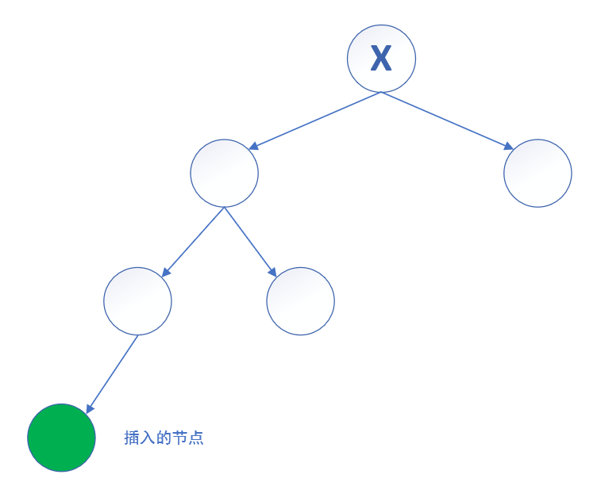
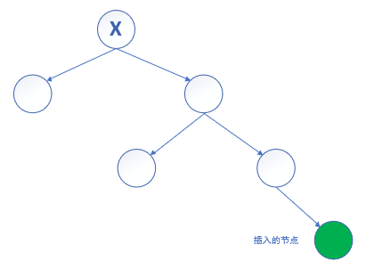
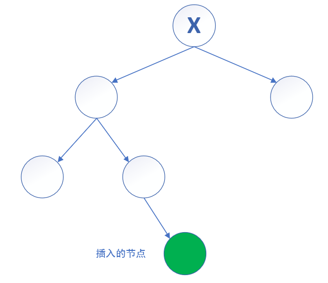
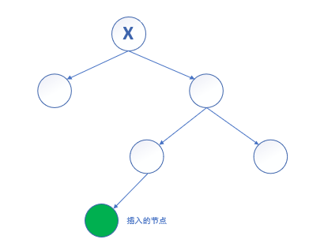
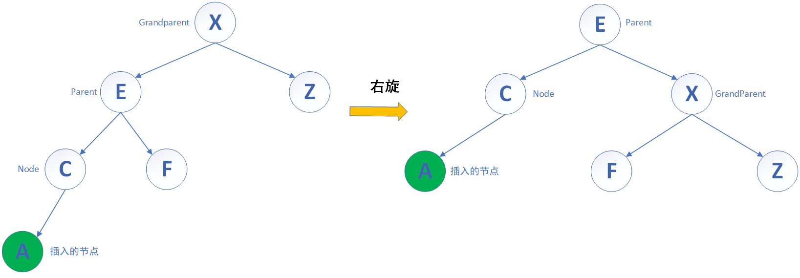
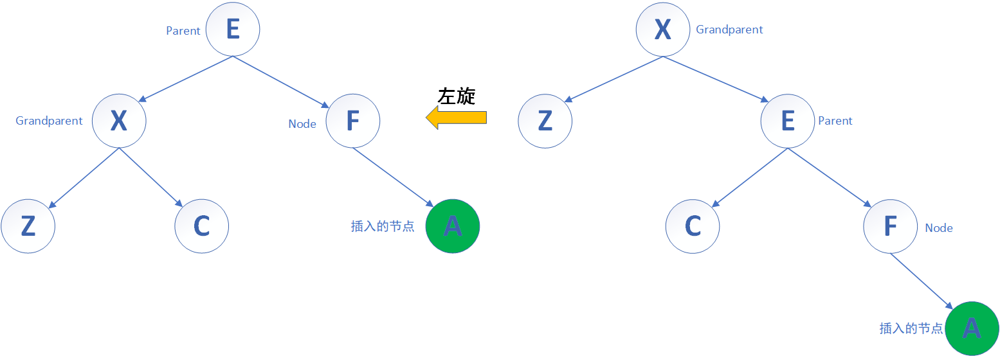
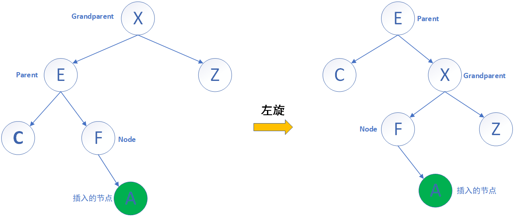
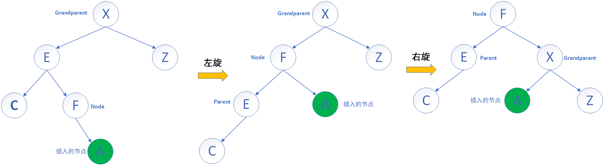
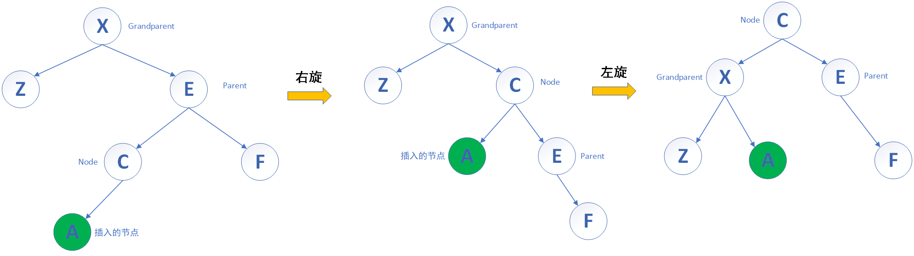

# Balance-Binary-Tree

## 1 树的概述

树是由节点(nodes)和边(edges)组成的数据结构。

在相连节点中，在上面的节点叫做父节点，在下面的节点叫做子节点，无子节点的节点称为叶子节点(leaf)。

路径长度(length)：根节点到任意节点之间存在一条路径，路径所经过的边数称之为路径长度。

节点深度(depth)：根节点到任意节点的路径长度也就是节点深度。

节点大小(size)：是指某节点（包括它本身）与子节点的节点总数之和。默认每一个节点的节点大小为1。

节点高度(height)：根节点到叶子节点的路径长度称之为节点高度。

**注意**：

1. 在 `AVL` 树中，为了方便计算，每个节点的 `size` 被初始为1，每个节点的 `height` 被初始为0。

## 2 二叉搜索树

树根据子节点分支的数量的不同，就有不同的名称。如果有左右两个分支，那么称之为二叉树；如果有三个分支，那么称之为三叉树，以此类推。

那么什么是二叉搜索树呢？二叉搜索树就是只有左右子树两个分支，左子树的每一个值都小于等于根节点，根节点的值都大于等于右子树的每一个值。实际上去掉等于这个条件，也是二叉搜索树。在中序遍历下，遍历整棵二叉搜索树得到的数组就是一个从小到大排序的数组。

二叉搜索树可以在对数时间内对元素进行插入和访问，即 `logn` ，n为树的高度。

二叉搜索树在进行节点删除时，分为两种情况，假设要删除的节点为A节点，第一种情况是A节点有左子树或者右子树，那么直接删除A节点，让其左子树或者右子树接替其位置即可；第二种情况是A节点同时有左右子树，那么我们使用A节点的右子树中最小节点和其替换，再删除A节点即可。

由于二叉搜索树没有平衡机制，所以在进行多次插入或者删除之后，会导致整颗树失去平衡，即树的高度越来越高或者退化成链表。这样子会导致搜索效率大大下降。为了解决失去平衡的问题，使得搜索效率保持在对数水平，所以引入平衡机制，这就是所谓的平衡二叉树。

## 3 平衡二叉树

平衡二叉树就是在二叉搜索树的基础上加上平衡条件，而平衡条件的不同，又衍生出不同的平衡二叉树，比比如说 `AVL` 树和红黑树等。

## 4 `AVL` 树

`AVL` 树是一种平衡二叉树，它的平衡条件是任何节点左右子树的高度之差的绝对值不超过1。这是一种弱平衡，但是仍然可以保证对数深度的平衡状态。

有的同学有可能就问了，为什么不能保证任何节点左右子树的高度之差的绝对值为0。因为这个非常难做到，假如该树有四个节点，在不引入新节点的前提下，根本无法保证每个节点的左右子树的高度之差的绝对值为0；如果要引进新的节点，那势必更加复杂，考虑的情况变多就有点得不偿失。所以我们退而求次，只要求每个节点的左右子树的高度之差的绝对值不超过1即可。

### 4.1 插入

插入若干节点之后，可能会造成某个节点的不平衡，即其左右子树的高度之差的绝对值大于1，假设该节点为X，那么一共有四种失衡情况：

1. 左左情况

插入节点位于X节点的左子节点的左子树上。

2. 右右情况

插入节点位于X节点的右子节点的右子树上。

3. 左右情况

插入节点位于X节点的左子节点的右子树上。

4. 右左情况

插入节点位于X节点的右子节点的左子树上。

### 4.2 单旋

如果失衡的情况是左左或右右情况，那么只需要旋转一次。

1. 左左情况的单旋

当失衡情况是左左情况时，此时需要对Node节点的Parent节点进行一次右旋，这就是所谓的单旋。

那么Node、Parent和Grandparent该如何确定呢？当我们插入A时，会发现此时X就是失去平衡的节点，这个节点就是Grandparent节点，此时再观察插入节点A所在的位置，A节点在Grandparent节点的左侧，所以Grandparent节点的左节点E就是Parent节点，最后再看A位于Parent节点的左子树还是右子树，我们发现A节点在左子树，所以E节点的左子节点就是Node节点。

当找到这三个节点之后，该如何右旋呢？即将Parent节点进行右旋，Parent节点升高，变成新的根节点Root，Grandparent节点下降，变成Parent节点的右子节点，同时Parent节点的原本的右子节点F（如果存在的话，在本图是存在的）会断开和Parent的连接，变成Grandparent节点的左子节点。这就是右旋。

经过右旋，我们可以看到AVL树重新恢复平衡，即每一个节点的左右子树高度之差的绝对值不超过1。

2. 右右情况的单旋

当失衡情况是右右情况时，此时需要对Node节点的Parent节点进行一次左旋，这就是所谓的单旋。Grandparent、Parent和Node找法参照左左情况。

当进行左旋时，会把Parent节点进行左旋，Parent节点升高，变成新的根节点Root，Grandparent节点下降，变成Parent节点的左子节点，同时Parent节点的原本的左子节点C（如果存在），和Parent节点断开连接，并成为Grandparent节点的右子节点。

经过左旋，我们可以看到AVL树重新恢复平衡，即每一个节点的左右子树高度之差的绝对值不超过1。

### 4.3 双旋

如果失衡情况是左右或右左情况，那么需要两次旋转，这就是所谓的双旋。

那么有同学可能会问了，为什么只旋转一次不行呢？因为这两种情况只旋转一次的话，没办法让树恢复平衡。比如说对左右情况只旋转一次，我们对Grandparent节点进行一次旋转。

从上图可知，AVL 树还是没有平衡，此外无论对Parent还是Node节点只进行一次旋转的话，是没办法恢复平衡的。综上所述，我们要两次旋转，而且是对Node节点进行两次旋转，这样子才能恢复AVL树的平衡。

1. 左右情况的双旋

如果失衡情况是左右情况，那么需要对Node节点进行一次左旋，再对Node节点进行一次右旋。Node、Parent和Gradparent节点的找法参照左左情况。

先对Node进行一次左旋，Node节点升高，取代Parent节点，变成子树的根节点，Parent节点下降，变成Node节点的左子节点，如果Node节点的左子节点存在，还必须将左子节点接到Parent节点的右子节点那里。在本图中，Node节点的左子节点不存在，也就不用这样子操作。

再对Node进行一次右旋，Node节点升高，取代Grandparent节点，变成整棵树的根节点，Grandparent节点下降，变成Node节点的右子节点，同时Node节点的右子节点A存在，所以A节点断开和Node节点连接，变成Grandparent节点的左子节点。此时AVL树重新恢复平衡，即每一个节点的左右子树高度之差的绝对值不超过1。

2. 右左情况的双旋

右左情况是左右情况的镜像。

先对Node进行一次右旋，Node节点升高，取代Parent节点，变成子树的根节点，Parent节点下降，变成Node节点的右子节点。

再对Node进行一次左旋，Node节点升高，取代Grandparent节点，变成整颗树的根节点，Grandparent节点下降，变成Node节点的左子节点，同时Node节点的左子节点A断开与Node节点的连接，变成Grandparent节点的右子节点。此时AVL树重新恢复平衡，即每一个节点的左右子树高度之差的绝对值不超过1。

## 5 作者的话

1. 以上内容是作者的练习项目，如有错误，还请多多包涵。如果老铁们能够帮忙改善，那么作者不胜感激。
2. 如果觉得本项目不错，还请老铁们动动你们性感的小手，帮忙点一下Star，拜谢！
